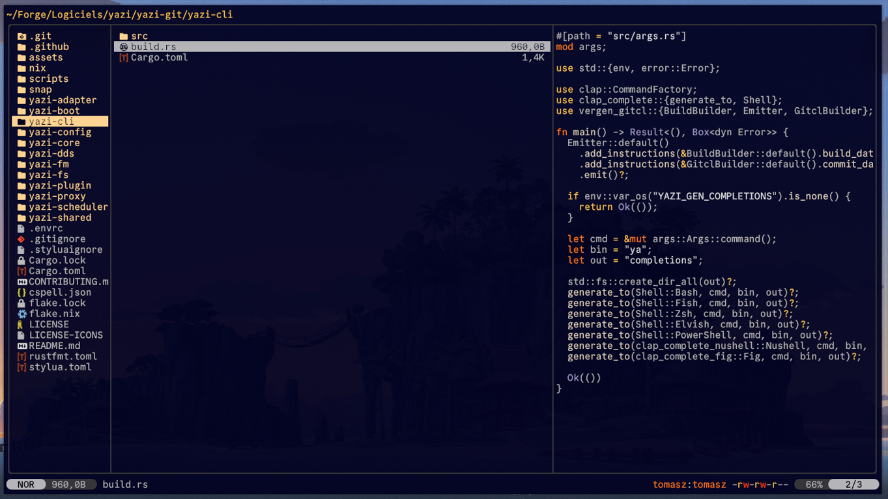

<div align="center">
  
</div>

## Falcon flavor for [Yazi](https://github.com/sxyazi/yazi)

falcon.yazi is based on [falcon](https://github.com/fenetikm/falcon)'s colors and its sublime .tmTheme template. It is usable standalone or with associated terminal themes found in falcon's extras.

## 👀 Preview



## 🎨 Installation

```bash
ya pack -a tkapias/falcon.yazi
```

## ⚙️ Usage

Add the these lines to your `theme.toml` configuration file to use it:

```toml
[flavor]
use = "falcon"
```

## 📜 License

The flavor is MIT-licensed, and the included tmTheme is also MIT-licensed.

Check the [LICENSE](LICENSE) and [LICENSE-tmtheme](LICENSE-tmtheme) file for more details.
